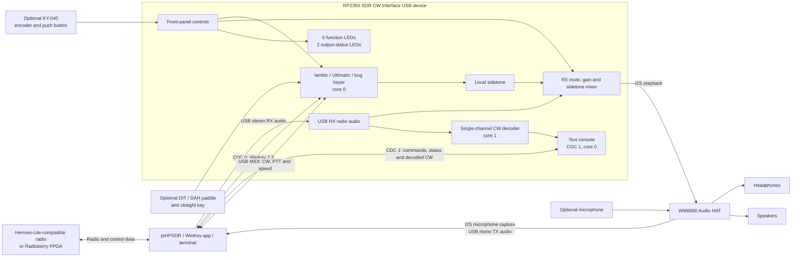

# RP2350 SDR CW Interface

CW keyer for radios with MIDI control and USB sound-card input and output,
running on a Waveshare RP2350-PiZero with a WM8960 Audio HAT.

The firmware combines the following functions in a single USB device:

- stereo RX audio from the computer to the headphones;
- mono TX audio from the WM8960 microphone input to the computer;
- a WinKey 2.3-compatible serial connection;
- a separate text console for status and settings;
- a single-channel CW decoder for received radio audio, with decoded text
  displayed through the console serial port;
- USB MIDI for CW, PTT, and sidetone-frequency information;
- an Iambic/Ultimatic/bug keyer and a separate straight key;
- a locally generated sidetone, adjustable from 300 to 1200 Hz (750 Hz by
  default);
- user-selectable control from either the serial terminal or the front panel,
  using one rotary encoder and five function LEDs.

> **Status:** the composite firmware has been tested successfully on Windows,
> macOS, and Linux. It uses standard USB Audio, CDC, and MIDI classes without a
> device-specific driver.


## System overview



## Required hardware

- Waveshare RP2350-PiZero;
- Waveshare WM8960 Audio HAT;
- USB cable supporting both power and data.

The physical keying and front-panel controls are optional. Settings can be
controlled entirely from the terminal, so a KY-040 module, LEDs, and LED resistors do
not have to be fitted. Physical controls may be used instead of, or alongside,
the terminal. Add only the parts required for the intended installation:

- CW paddle with DIT, DAH, and common contacts, for physical paddle keying;
- optional separate straight key, for manual straight-key operation;
- optional **Rotary Encoder Module KY-040**, with quadrature outputs and push
  button, for physical settings control. Power this module from **3.3 V only**;
  never apply 5 V signals to the RP2350 GPIO pins;
- optionally up to seven LEDs: five function LEDs and two output-status LEDs;
- one 220–470 ohm current-limiting resistor for each optional fitted LED.

### Where to buy the main boards

The two main Waveshare boards can be ordered directly from Waveshare or from
BerryBase in Europe. Availability and prices may change.

| Component | Waveshare | BerryBase |
|---|---|---|
| RP2350-PiZero | [Waveshare product page](https://www.waveshare.com/product/rp2350-pizero.htm) | [BerryBase product page](https://www.berrybase.de/waveshare-rp2350-pizero-development-board-dual-core-arm-oder-risc-v-mini-hdmi-usb-c-150mhz) |
| WM8960 Audio HAT | [Waveshare product page](https://www.waveshare.com/wm8960-audio-hat.htm) | [BerryBase product page](https://www.berrybase.de/en/wm8960-hi-fi-stereo-sound-hat-for-raspberry-pi) |

## Connections

The physical pin numbers follow the standard Raspberry Pi 40-pin header on the
RP2350-PiZero. When in doubt, consult the official
[Waveshare schematic](https://files.waveshare.com/wiki/RP2350-PiZero/RP2350-PiZero.pdf).

| Function | RP2350 GPIO | Physical header pin | Connection |
|---|---:|---:|---|
| WM8960 I2C SDA | GPIO2 | 3 | SDA |
| WM8960 I2C SCL | GPIO3 | 5 | SCL |
| Encoder A/CLK | GPIO15 | 29 | Encoder A or CLK |
| Encoder B/DT | GPIO6 | 31 | Encoder B or DT |
| Encoder push button | GPIO13 | 33 | Connects to GND when pressed |
| Master-volume LED | GPIO7 | 26 | Through 220–470 ohm to LED anode |
| Sidetone-volume LED | GPIO8 | 24 | Through 220–470 ohm to LED anode |
| Sidetone-frequency LED | GPIO12 | 21 | Through 220–470 ohm to LED anode |
| Keyer-speed LED | GPIO11 | 19 | Through 220–470 ohm to LED anode |
| Output-function LED | GPIO10 | 23 | Through 220–470 ohm to LED anode |
| Headphone-active LED | GPIO24 | 18 | Through 220–470 ohm to LED anode |
| Speaker-active LED | GPIO25 | 20 | Through 220–470 ohm to LED anode |
| Paddle DIT | GPIO23 | 16 | DIT contact to GND |
| I2S BCLK | GPIO18 | 12 | WM8960 BCLK |
| I2S LRCLK | GPIO19 | 35 | WM8960 LRCLK |
| I2S ADC data | GPIO20 | 38 | WM8960 ADCDAT |
| I2S DAC data | GPIO21 | 40 | WM8960 DACDAT |
| Straight key | GPIO22 | 15 | Key contact to GND |
| Paddle DAH | GPIO27 | 13 | DAH contact to GND |

The WM8960 Audio HAT also connects its configurable onboard button to GPIO17
(physical pin 11). That pin is therefore reserved for the HAT and is not used
for a paddle or front-panel control. The audio HAT reserves GPIO2, GPIO3,
GPIO17, GPIO18, GPIO19, GPIO20 and GPIO21 in total.

All key and encoder inputs are active low and use the RP2350 internal pull-up
resistors. Connect the common contacts of the paddle, straight key, and encoder
push button to GND.

Connect each LED as follows:

```text
GPIO --- 220 to 470 ohm ---|>|--- GND
                           LED
```

The long lead of a typical LED is the anode and connects to the GPIO through
the resistor. The short lead is the cathode and connects to GND.

## Installing the firmware

1. Disconnect the RP2350 from USB.
2. Hold the BOOTSEL button.
3. Connect the USB cable and release BOOTSEL.
4. A USB drive with a name such as `RPI-RP2` appears.
5. Copy `rp2350-sdr-cw-interface.uf2` to that drive.
6. The RP2350 automatically restarts as the CW keyer.

The locally built firmware is located at:

```text
build-audio-duplex-cdc-midi/rp2350-sdr-cw-interface.uf2
```

## USB devices

| USB function | Device name | Format or purpose |
|---|---|---|
| Audio output | RP2350 SDR RX Audio | Stereo, 48 kHz, 16-bit |
| Audio input | RP2350 SDR TX Audio | Mono, 48 kHz, 16-bit |
| Serial port 1 | RP2350 SDR WinKey | Binary WinKey 2.3 protocol |
| Serial port 2 | RP2350 SDR Console | Text status and settings console |
| MIDI | RP2350 SDR MIDI | CW, PTT, and speed |

The two serial interfaces have deliberately separate roles. The WinKey port
carries binary protocol data and must not be opened in a regular Serial
Monitor. The Console port accepts readable commands and can remain open while
a WinKey application uses the first port. Only one program can open each COM
or serial port at a time.

## Control console

Open **RP2350 SDR Console** in a terminal program. A displayed baud
rate such as 115200 may be selected, but USB CDC does not use it to determine
the actual transfer speed. Commands are case-insensitive and are applied
immediately:

```text
show
help

set speed 5..99
set master-volume 0..100
set sidetone-volume 0..100
set tone-frequency 300..1200
set cw-frequency 300..1200
set frequency-link on
set frequency-link off
set output headphones
set output speakers
set output both

set mode iambic-a
set mode iambic-b
set mode ultimatic
set mode bug
set paddle-swap on
set paddle-swap off
set weight 0..100
set decoder on
set decoder off
set decoder-frequency 300..1200
set decoder-speed auto
set decoder-speed 5..60
set decoder-telemetry on|off
set decoder-source all|rx|key|wk|off

save
reload
```

`show` prints all current console-controlled settings. `help` prints the command
summary. Invalid values are rejected without changing the current setting.
`save` stores the complete current configuration in flash using the same safe,
redundant storage as the encoder double-click. The console reports when this
asynchronous write has completed. `reload` discards unsaved changes and restores
the newest configuration currently held in the saved flash snapshot.

Frequency linking is on by default. With `frequency-link on`, changing either
`tone-frequency` or `decoder-frequency` changes both. Enabling the link uses
the current sidetone as the leading value. Sidetone changes received through
the WinKey interface also update the decoder while the link is on. Use
`frequency-link off` when the
receive pitch must temporarily differ from the local sidetone. The command
`set cw-frequency 780` always sets both values, independent of the link state.
Only the sidetone portion and therefore the linked startup value is currently
persistent when `save` is used; the off state itself is session-only.

For example:

```text
cw> set speed 24
OK speed=24
cw> set output both
OK output=both
cw> save
OK save started
EVENT settings-saved
```

The console implementation is isolated from the binary WinKey parser. Its
event-output entry point receives decoder results through a queue from core 1;
TinyUSB and both CDC interfaces remain owned by core 0.

## CW decoder

The decoder is disabled by default. Enable it with `set decoder on`; it then
listens to the RX/radio audio received from the computer, before output muting,
master-volume processing, and sidetone mixing. It does not use the WM8960
microphone input. DSP runs on RP2350 core 1 while decoded characters are
transferred to core 0 and printed on the Console port, for example:

```text
CW: CQ TEST 12345
```

Characters remain on one continuous `CW:` line while CW activity continues.
After two seconds without a detected tone, the line is closed and the `cw>`
prompt returns.

Letter and word boundaries compensate for the decoder's two-window tone
debounce. A 1.25-DIT measured silence closes a letter. A more conservative
5-DIT silence inserts a word space so Farnsworth letter spacing is retained.

The decoder is deliberately single-channel. Its default center frequency is
750 Hz; it does not scan six separate frequency regions. Match the radio's CW
pitch to that frequency, or use `set decoder-frequency 300..1200`. Use
`set decoder off` to stop decoding and `set decoder on` to restart it. `show`
reports the selected frequency, learned speed, and any dropped decoder samples.
The frequency and on/off state are session settings and are not yet included
in `save`.

Tone detection uses overlapping 10 ms analysis windows with a new timing
decision every 5 ms. This improves short DIT and gap measurements without
doubling the detector bandwidth.

For a recording with a known speed, `set decoder-speed 20` fixes the timing at
20 WPM and prevents noise from changing the DIT/DAH boundary. Use the LCWO
character speed, not its lower effective/Farnsworth speed. Return to adaptive
radio decoding with `set decoder-speed auto`.

## Audio setup

### Windows

1. Open **Settings → System → Sound**.
2. Select **RP2350 SDR RX Audio** as the output device.
3. Select **RP2350 SDR TX Audio** as the input device.
4. In the advanced audio properties, verify that 48 kHz is selected.
5. Play the Windows test tone or audio from a web browser.

The Windows output-device volume and mute controls are applied digitally to
the incoming USB samples. The encoder master-volume setting is a separate,
analog WM8960 output-volume control applied after the USB volume.

### macOS

1. Open **Audio MIDI Setup**.
2. Select **RP2350 SDR RX Audio** for output.
3. Select **RP2350 SDR TX Audio** for input.
4. Set both devices to 48 kHz if necessary.
5. Open **Window → Show MIDI Studio** to verify the MIDI device.

At enumeration the firmware recognizes macOS and changes the Full-Speed USB
feedback endpoint from the Windows-compatible four-byte 16.16 representation
to the USB-standard three-byte 10.14 representation required by macOS. This is
automatic; the same firmware remains usable on Windows and Linux.

### Linux or Raspberry Pi

Check the detected devices with:

```bash
aplay -l
arecord -l
aconnect -l
ls -l /dev/ttyACM*
```

The two ports normally appear as consecutive `/dev/ttyACM*` devices. Their
numbers depend on other connected hardware, so use `/dev/serial/by-id` or the
USB interface name to distinguish the WinKey and Console ports. On many Linux
systems, the user must be a member of the `dialout` group to open them.

## Audio behavior while keying

When the keyer becomes active, USB RX audio is smoothly muted at the selected
analogue outputs. The locally generated sidetone remains audible. USB RX audio also stays
muted during the spaces between DIT and DAH elements. It smoothly returns after
the final element and the configured hang/tail interval.

The playback path keeps a small PCM reserve and couples its fill level to the
USB asynchronous feedback endpoint. This compensates for the small clock
difference between the computer and the RP2350. If a stream is interrupted
despite that reserve, playback fades to zero and restarts with a short fade-in
instead of making an abrupt, audible sample transition.

This behavior applies to:

- the DIT and DAH paddles;
- the straight key;
- text sent through the WinKey protocol;
- incoming MIDI key and PTT messages.

## Paddle and straight key

By default, the paddle operates in **Iambic A** mode:

- GPIO23 generates DIT elements;
- GPIO27 generates DAH elements;
- GPIO22 is a separate straight-key input;
- the straight key has priority over the paddle.

A WinKey application can also select Iambic B, Ultimatic, bug mode, and paddle
swap. Paddle swap exchanges the DIT and DAH functions without changing the
wiring.

## Encoder controls

At startup, all function LEDs are off and rotating the encoder has no effect.
The GPIO24 and GPIO25 status LEDs immediately show the restored output routing.
Each short press of the encoder selects the next function:

| Press | Active LED | Physical pin | Setting | Range | Step |
|---:|---|---:|---|---:|---:|
| 1 | GPIO7 | 26 | Master volume | 0–100% | 5% |
| 2 | GPIO8 | 24 | Sidetone volume | 0–100% | 5% |
| 3 | GPIO12 | 21 | Sidetone frequency | 300–1200 Hz | 10 Hz |
| 4 | GPIO11 | 19 | Keyer speed | 5–99 WPM | 1 WPM |
| 5 | GPIO10 | 23 | Output routing | Headphones / speakers / both | One position |
| 6 | None | — | No function selected | — | — |

The cycle then starts again with master volume. No more than one function LED
is on at a time. GPIO24 is on whenever the headphone output is active and
GPIO25 is on whenever the speaker output is active; both are on in the combined
position. These two status LEDs remain visible regardless of the selected
encoder function. A single-click action is confirmed after the 400 ms
double-click detection window has expired.

If clockwise rotation decreases the value, swap the GPIO15 and GPIO6 encoder
connections.

### Difference between the two volume controls

- **Master volume** controls both WM8960 analogue output paths and affects both
  RX audio and sidetone on every active output.
- **Sidetone volume** controls only the locally generated CW tone in the
  digital audio mixer.

## Saving settings

Saving is deliberately under user control:

- **single click:** select the next encoder function;
- **double-click within 400 ms:** save the current settings;
- no automatic save is performed;
- disconnecting USB or switching off does not initiate a save;
- a double-click does not write flash when nothing has changed.

All seven LEDs illuminate while a flash write is in progress. One simultaneous
LED pulse confirms a successful save or that the settings were already
unchanged. Three rapid pulses indicate a storage error.

The saved data includes:

- master volume;
- output routing: headphones, speakers, or both;
- sidetone volume and exact frequency;
- keyer speed;
- WinKey mode, weighting, ratio, PTT, paddle, and timing settings;
- the complete 256-byte virtual WinKey EEPROM, including stored messages.

At startup, the newest valid explicitly saved record is loaded. Unsaved changes
are intentionally discarded after a power cycle. If no valid saved record is
present, the following defaults are used:

| Setting | Default value |
|---|---:|
| Master volume | 80% |
| Output routing | Headphones and speakers |
| Sidetone volume | 25% |
| Sidetone frequency | 750 Hz |
| Keyer speed | 21 WPM |
| Virtual MIDI PTT | Off |

A WinKey application can change frequency and speed during a session. The most
recent WinKey setting takes priority until the encoder is rotated again. To
retain changes made in WKdemo, double-click the encoder before switching off.

Two alternating 4 KB flash sectors are used. The previous valid copy is kept
while the other sector is erased and programmed. Each record contains a format
version, sequence number, and CRC32. This allows an incomplete record to be
rejected if power is removed during a save.

## Using WinKey

The firmware emulates WinKey version 2.3 through the CDC serial port.

### Windows: WKdemo

For an initial test, download **WKdemo** from the official
[K1EL software page](https://www.k1elsystems.com/softwareX.html). Use WKdemo
for WinKeyer 1/2; do not use WK3demo.

1. Close the VS Code Serial Monitor and all other terminal applications.
2. Start WKdemo.
3. Select the COM port belonging to **RP2350 SDR WinKey**.
4. Open the WinKey connection.
5. Send text or change the speed, sidetone, and paddle mode.

Older WKdemo versions may only list COM1 through COM24. If Windows assigns a
higher number, change it through:

**Device Manager → Ports (COM & LPT) → Properties → Port Settings → Advanced →
COM Port Number**

It is best to disable automatic connection in the VS Code Serial Monitor.
Otherwise, the monitor may occupy the COM port before WKdemo opens it.

For contest operation,
[N1MM Logger+](https://n1mmwp.hamdocs.com/getting-started/downloading-the-software/)
can also be used. Select the correct COM port and configure it as WinKey.

### macOS and Linux

WKdemo and N1MM are Windows applications. On macOS or Linux, use a
WinKey-compatible application such as `flwkey`. The firmware and UF2 do not
need to be changed.

## MIDI

For a short setup and test procedure, including RX2/VAC2 monitoring, see
[Using the CW keyer with Thetis](THETIS-CW-SETUP.md). Import
`thetis-keyer.m2c` for the note 17 CW-key mapping.

The firmware sends the following events on MIDI channel 10:

| Event | MIDI message |
|---|---|
| CW key-down/up | Note 17 |
| PTT (piHPSDR mode) | Note 18 On/Off |
| Toggle PTT mode | Note 18 On at both PTT edges |
| Sidetone frequency | Control Change 3 (300..1000 Hz mapped to 0..127) |

The virtual MIDI PTT factory default is `off`, which is the safe setting for
Thetis: let Thetis Semi Break-In control transmit/receive, even when note 18 is
not mapped. For piHPSDR, enter `midi-ptt onoff` and save it; PTT down then sends
Note On and PTT up sends Note Off. The `toggle` mode remains available for other
host software but must not be used with Thetis. Run `save` (or double-click the
encoder) to retain the mode and `show` to inspect it.
DL1YCF piHPSDR can map CC3 as event **Controller**, type **Slider**, action
**CW Frequency** (`CWFREQ`). Its 0..127 slider range corresponds to 300..1000
Hz. Frequencies above 1000 Hz are reported as 1000 Hz because that is the
piHPSDR action limit. Stock Thetis has no MIDI action for CW Pitch, so its CW
Pitch must be set manually to the same value as the keyer.

For a manual key-down test, send the following MIDI message:

```text
99 11 7F
```

Meaning:

- `99`: Note On, MIDI channel 10;
- `11`: note 17 in hexadecimal;
- `7F`: velocity 127, producing key-down.

Send key-up with:

```text
99 11 00
```

For convenient sidetone testing, the firmware also accepts note 17 when a MIDI
test program sends it on a different channel.

## Building the firmware

Requirements:

- Raspberry Pi Pico SDK 2.3.0;
- CMake;
- Ninja or another CMake-supported build system;
- an ARM GCC toolchain supported by the Pico SDK.

Configure and build from this directory:

```bash
cmake -S . -B build-audio-duplex-cdc-midi -G Ninja \
  -DRP2350_USB_AUDIO_DUPLEX_CDC_MIDI=ON
cmake --build build-audio-duplex-cdc-midi
```

The firmware contains a project-local backport that correctly reactivates
RP2040/RP2350 isochronous USB audio endpoints. It does not modify the installed
Pico SDK. The final 8 KB of the configured 4 MB application flash is reserved
at runtime for the two persistent-settings sectors.

## Troubleshooting

### The serial port cannot be opened

- Close WKdemo, N1MM, the VS Code Serial Monitor, and other terminal programs.
- Open only one application that uses the serial port.
- Disable automatic connection in the VS Code Serial Monitor.
- Briefly disconnect USB and check the newly assigned COM or tty device.
- On Windows, assign a COM number no higher than COM24 if WKdemo requires it.
- On Linux, check the permissions of `/dev/ttyACM*`.

### The audio devices exist, but there is no sound

- Select **RP2350 SDR RX Audio** as the output device.
- Verify that the audio format is 48 kHz.
- Check the WM8960 headphone connection.
- Select master volume with the encoder and increase it.
- Ensure that the keyer is not permanently active; USB RX audio is
  intentionally muted while keying.

### macOS lists the output device, but it is silent

- Flash the current `rp2350-sdr-cw-interface.uf2`. Its USB device-release field is
  `bcdDevice = 0x0137`, displayed as **Version 1.37** rather than `0x0137`.
- To check it on macOS, open **System Information → Hardware → USB**, select the
  RP2350 SDR Interface device, and inspect its version. This value is not shown in Audio
  MIDI Setup or in the UF2 filename.
- Disconnect and reconnect the USB device after flashing so macOS reads the
  updated USB 2.01 and BOS descriptors.
- In **Audio MIDI Setup**, select **RP2350 SDR RX Audio**, choose 48,000 Hz and
  two-channel 16-bit audio, then select it again as the system output.

### There is no sidetone

- Verify that master volume and sidetone volume are not set to 0%.
- Test GPIO22 separately by briefly connecting it to GND.
- Test DIT on GPIO23 and DAH on GPIO27.
- Verify that normal USB audio is audible through the WM8960 headphones.

### The encoder turns the wrong way or misses steps

- Swap GPIO15 and GPIO6 if the direction is reversed.
- Keep the encoder wires short.
- Check the common GND connection.
- Do not use 5V pull-ups on an encoder module.

### Settings are not restored after a restart

- Changes are saved only after an encoder double-click.
- Wait for the simultaneous LED confirmation before removing power.
- A single click only changes the selected function.
- Three rapid LED pulses indicate that the flash record could not be written.
- Flashing or erasing the complete device may also erase saved settings.

### The USB device is not recognized

- Try another USB data cable and preferably avoid an unpowered hub.
- Hold BOOTSEL and flash the UF2 again.
- Fully disconnect the device before reconnecting it.
- Check the WM8960 power and GND connections.

## Source code and license

The WinKey state machine is a Pico SDK port based on
[dl1ycf/TeensyWinkeyEmulator](https://github.com/dl1ycf/TeensyWinkeyEmulator),
written by Christoph van Wüllen, DL1YCF. The port retains the
`GPL-2.0-only` license. See [WINKEY_PORT.md](WINKEY_PORT.md) for details about
the port, hardware mapping, and license provenance.
